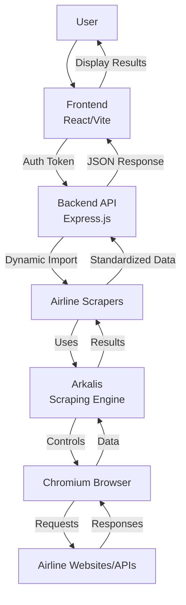
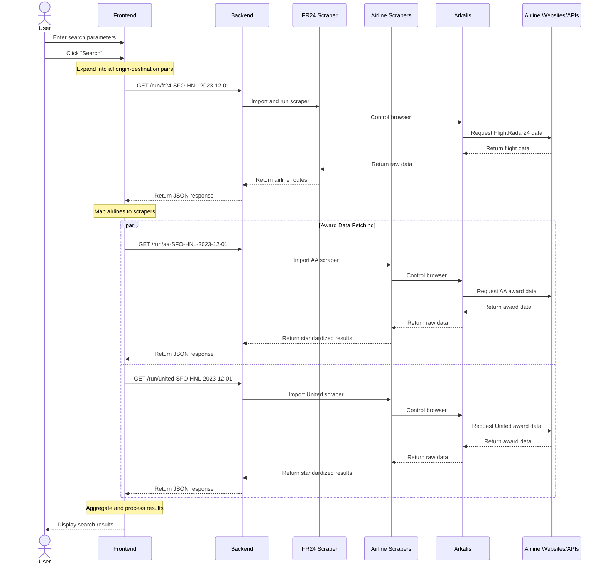

# AwardWiz Design Document

<div align="center">
  
</div>

## 1. Introduction

### Project Goal

AwardWiz is a specialized search engine designed to find airline award ticket availability across multiple carriers. It enables users to efficiently discover opportunities to use their frequent flyer miles or points for flight redemptions, focusing on direct flights between specified origins and destinations.

The project's primary value proposition is helping travelers:
- Find available award seats across multiple airlines in one search
- Identify low-fare award availability (specific booking classes like X, I, O)
- Distinguish between award seats and cash-based fares (relevant for programs like Chase Ultimate Rewards)
- Discover flights with premium amenities (lie-flat pods, WiFi)

### Core Problem

The core technical challenge AwardWiz addresses is reliably accessing award availability data from airline websites. This is difficult because:

1. Airlines don't provide public APIs for award availability
2. Airlines employ sophisticated anti-botting systems (like Akamai) to prevent automated access
3. Each airline has unique website structures, authentication requirements, and data formats
4. Award availability data is dynamic and can change rapidly

The solution requires a specialized scraping approach that can:
- Mimic human browsing behavior to avoid detection
- Handle different airline website structures
- Standardize disparate data formats into a unified model
- Cache results appropriately to balance freshness with performance

## 2. High-Level Architecture

AwardWiz consists of three main components:

1. **Frontend (`awardwiz/`)**: A React-based web application that provides the user interface for searching and displaying results.
2. **Backend API (`awardwiz-scrapers/`)**: An Express.js server that authenticates requests and orchestrates the execution of airline-specific scrapers.
3. **Scraping Engine (`arkalis/`)**: A custom-built, anti-botting-focused browser automation library that powers the scrapers.

### Technology Stack Summary

- **Languages**: TypeScript/JavaScript (Node.js)
- **Frontend**: React, Vite, Ant Design, TanStack Query
- **Backend**: Express.js, Firebase Auth
- **Scraping**: Custom Arkalis engine (Chrome DevTools Protocol)
- **Data Storage**: Firebase (for user data), Local caching
- **Development**: Docker (Dev Container), Just (task runner), ESLint
- **Deployment**: Docker

### Component Interaction



The diagram illustrates how user requests flow through the system:
1. The user interacts with the React frontend
2. The frontend makes authenticated requests to the backend API
3. The backend dynamically loads the appropriate airline scrapers
4. Scrapers use Arkalis to control a Chromium browser instance
5. Arkalis handles the interaction with airline websites/APIs
6. Results flow back through the chain, with each component performing its specific transformations

## 3. Component Deep Dive

### Frontend (`awardwiz/`)

#### Purpose
The frontend serves as the user interface for AwardWiz, allowing users to:
- Input search parameters (origins, destinations, date)
- Trigger searches across multiple airlines
- View and filter search results
- Access detailed flight information

#### Key Libraries
- **React**: Core UI framework
- **Vite**: Build tool and development server
- **Ant Design**: UI component library providing the visual elements
- **TanStack Query**: Data fetching, caching, and state management
- **Firebase Auth**: User authentication (via Google OAuth)
- **dayjs**: Date handling

#### Core Workflow (`useAwardSearch` hook)
The `useAwardSearch` hook orchestrates the entire search process through a multi-step workflow:

1. **Route Expansion**: Takes user input (multiple origins/destinations) and creates all possible origin-destination pairs.
   ```typescript
   // From useAwardSearch.ts
   const datedRoutes = React.useMemo(() => {
     setStoppedQueries([])
     return expandOriginsDestinations(searchQuery)
   }, [searchQuery])
   ```

2. **Airline Discovery**: For each route pair, queries FlightRadar24 (via the `fr24` scraper) to identify which airlines actually operate on those routes.
   ```typescript
   // From useAwardSearch.ts
   const airlineRouteQueriesOpts = datedRoutes.map((datedRoute): UseQueryOptions<AirlineRoute[], Error> => ({
     queryKey: queryKeyForAirlineRoute(datedRoute),
     queryFn: async ({ signal }) => {
       const request = await runScraper<AWFR24Response>("fr24", datedRoute, signal)
       return fr24ResponseToAirlineRoutes(request)
     },
     // Cache for 30 days since airline routes rarely change
     staleTime: 1000 * 60 * 60 * 24 * 30,
     cacheTime: 1000 * 60 * 60 * 24 * 30,
     // ...
   }))
   ```

3. **Scraper Selection**: Based on the airlines identified, determines which scrapers to run (e.g., `aa` for American Airlines).
   ```typescript
   // From useAwardSearch.ts
   const { scrapersToRun, airlineRoutes } = React.useMemo(() => {
     const stableAirlineRoutes = airlineRouteQueries.flatMap((query) => query.data).filter((item): item is AirlineRoute => !!item)
     const scrapersToRun = scrapersByAirlineRoutes(stableAirlineRoutes, searchQuery.departureDate)
     return { scrapersToRun, airlineRoutes: stableAirlineRoutes }
   }, [airlineRouteQueries, searchQuery.departureDate])
   ```

4. **Award Data Fetching**: Executes the selected scrapers to retrieve award availability data.
   ```typescript
   // From useAwardSearch.ts
   const scraperQueriesOpts = scrapersToRun.map((scraperToRun): UseQueryOptions<ScraperResponse, Error> => ({
     queryKey: queryKeyForScraperResponse(scraperToRun),
     staleTime: 1000 * 60 * 15,  // Cache for 15 minutes
     cacheTime: 1000 * 60 * 15,
     queryFn: async ({ signal }) => {
       const response = await runScraper(scraperToRun.scraperName, scraperToRun.forDatedRoute, signal)
       // ...
       return response
     },
     // ...
   }))
   ```

5. **Result Aggregation**: Processes and merges the results from all scrapers into a unified format.
   ```typescript
   // From useAwardSearch.ts
   const { flights, scraperResponses } = React.useMemo(() => {
     const scraperResponses = scraperQueries.flatMap((query) => query.data).filter((item): item is ScraperResponse => !!item)
     return { flights: flightsFromScraperResponses(scraperResponses), scraperResponses }
   }, [scraperQueries])
   ```

#### Authentication Flow
The frontend uses Firebase Authentication with Google OAuth:

1. The `LoginScreen` component wraps the main application, ensuring users are authenticated before accessing the search functionality.
2. Upon successful login, the user's Firebase ID token is stored and used for API requests.
3. This token is included in the `Authorization` header when making requests to the backend:
   ```typescript
   // From runScraper.ts
   const token = import.meta.env.VITE_SCRAPERS_TOKEN ?? await firebaseAuth.currentUser?.getIdToken()
   if (!token)
     throw new Error("Missing token for scraper call")
   const axiosResponse = await axios.get<T>(`${import.meta.env.VITE_SCRAPERS_URL}/run/${scraperName}-${datedRoute.origin}-${datedRoute.destination}-${datedRoute.departureDate}`, {
     headers: {
       Authorization: `Bearer ${token}`
     },
     signal
   })
   ```

#### Caching Strategy
AwardWiz implements a sophisticated caching strategy using TanStack Query:

1. **In-Memory Cache**: TanStack Query provides an in-memory cache for all API responses.
2. **Persistence**: The cache is persisted to `localStorage` to survive page reloads and browser sessions:
   ```typescript
   // From main.tsx
   const localStoragePersister = createSyncStoragePersister({ storage: window.localStorage })
   persistQueryClient({ queryClient, persister: localStoragePersister })
   ```
3. **Tiered TTL**: Different data types have different cache durations:
   - Airline routes (FR24 data): 30 days (routes rarely change)
   - Award availability data: 15 minutes (availability changes frequently)
   - General queries: 12 hours stale time, 24 hours cache time
4. **Search History**: The last search query is also saved to `localStorage` for user convenience.

This caching strategy significantly improves performance and reduces unnecessary API calls, especially for airline route data that changes infrequently.

### Backend API (`awardwiz-scrapers/`)

#### Purpose
The backend API serves as the orchestration layer between the frontend and the individual airline scrapers. Its responsibilities include:
- Authenticating and authorizing user requests
- Managing concurrency and rate limits
- Dynamically loading and executing the appropriate scrapers
- Caching results to improve performance and reduce load on airline websites
- Providing a consistent API for the frontend

#### Key Libraries
- **Express.js**: Web server framework
- **express-jwt**: JWT authentication middleware
- **jwks-rsa**: Retrieves RSA signing keys from a JWKS endpoint (Google)
- **Bottleneck**: Rate limiting and concurrency control
- **express-rate-limit**: API-level rate limiting per user

#### API Endpoint
The backend exposes a single primary endpoint for running scrapers:

```
GET /run/:scraperName-:origin-:destination-:departureDate
```

For example: `/run/aa-SFO-HNL-2023-12-01` would run the American Airlines scraper for flights from San Francisco to Honolulu on December 1, 2023.

The endpoint parameters are validated using regex patterns to ensure they match expected formats:
```javascript
// From main-server.ts
app.get("/run/:scraperName(\\w+)-:origin([A-Z]{3})-:destination([A-Z]{3})-:departureDate(\\d{4}-\\d{2}-\\d{2})", async (req: Request, res: Response) => {
  // ...
})
```

#### Authentication Handling
The backend implements a dual authentication strategy:

1. **User Authentication**: Uses Firebase Authentication (Google) with JWT verification:
   ```javascript
   // From main-server.ts
   app.use(expressjwt({
     secret: jwksRsa.expressJwtSecret({
       cache: true,
       rateLimit: true,
       jwksRequestsPerMinute: 5,
       jwksUri: "https://www.googleapis.com/robot/v1/metadata/jwk/securetoken@system.gserviceaccount.com"
     }) as GetVerificationKey,
     algorithms: ["RS256"],
     audience: SERVER_CONFIG.googleProjectId,
     issuer: `https://securetoken.google.com/${SERVER_CONFIG.googleProjectId}`
   }))
   ```

2. **Service Worker Authentication**: Uses a shared secret for internal service workers:
   ```javascript
   // From main-server.ts
   if (SERVER_CONFIG.serviceWorkerJwtSecret) {
     app.use((err: any, req: Request, res: Response, next: NextFunction) => (err as { name: string }).name === "UnauthorizedError"
       ? void expressjwt({
           secret: SERVER_CONFIG.serviceWorkerJwtSecret!,
           algorithms: ["HS256"],
         })(req, res, next)
       : next(err))
   }
   ```

This dual approach allows both regular users (via the frontend) and automated processes (like notification workers) to access the API securely.

#### Concurrency & Rate Limiting
The backend implements two levels of rate limiting:

1. **Per-User Rate Limiting**: Restricts each user to a maximum number of requests within a time window:
   ```javascript
   // From main-server.ts
   app.use(rateLimit({
     windowMs: SERVER_CONFIG.rateLimitWindowMs,  // Default: 1 hour
     max: SERVER_CONFIG.rateLimitMax,            // Default: 100 requests
     standardHeaders: true,
     legacyHeaders: false,
     skip: (req: Request) => req.auth!["no-rl"] === true,  // Skip for service workers
     keyGenerator: (req: Request) => req.auth!.sub!,       // Rate limit by user ID
     // ...
   }))
   ```

2. **Global Concurrency Limiting**: Restricts the total number of concurrent scraper executions:
   ```javascript
   // From main-server.ts
   const limiter = new Bottleneck({ maxConcurrent: SERVER_CONFIG.concurrentRequests, minTime: 200 })
   app.get("/run/:scraperName(\\w+)-:origin([A-Z]{3})-:destination([A-Z]{3})-:departureDate(\\d{4}-\\d{2}-\\d{2})", async (req: Request, res: Response) => {
     // Limit concurrency
     await limiter.schedule(async () => {
       // Scraper execution logic
     })
   })
   ```

This two-tiered approach prevents both individual users from overwhelming the system and the system as a whole from overwhelming the airline websites.

#### Interaction with Arkalis
The backend dynamically imports the requested scraper module and invokes it using the Arkalis engine:

```javascript
// From main-server.ts
const scraper = await import(`./scrapers/${scraperName!}.js`) as AwardWizScraperModule
const query = { origin: origin!, destination: destination!, departureDate: departureDate! }

const cacheKey = scraperName === "fr24"
  ? `${scraper.meta.name}-${query.origin}${query.destination}`
  : `${scraper.meta.name}-${query.origin}${query.destination}-${query.departureDate.substring(5, 7)}${query.departureDate.substring(8, 10)}`

const results = await runArkalis(async (arkalis) => {
  arkalis.log("Running scraper for", query)
  const scraperResults = await scraper.runScraper(arkalis, query)
  arkalis.log(c.green(`Completed with ${scraperResults.length} results`))
  return scraperResults
}, debugOptions, scraper.meta, cacheKey)
```

Key aspects of this interaction:
1. **Dynamic Import**: Loads the appropriate scraper module based on the request parameter
2. **Cache Key Generation**: Creates a unique key for caching based on the scraper and query
3. **Arkalis Execution**: Calls `runArkalis` with the scraper's logic, debug options, metadata, and cache key
4. **Result Handling**: Returns the results (or error) as a JSON response to the frontend

### Scraping Engine (`arkalis/`)

#### Purpose
Arkalis is a specialized browser automation library designed specifically for scraping websites that employ sophisticated anti-botting measures. Unlike general-purpose automation tools, Arkalis focuses on:
- Evading detection by anti-botting systems like Akamai
- Providing a simple API for browser control and data extraction
- Offering robust caching and debugging capabilities
- Supporting proxy usage for distributed scraping

#### Core Technology
Arkalis uses the Chrome DevTools Protocol (CDP) directly, rather than higher-level automation frameworks:

```javascript
// Conceptual example of direct CDP usage
const client = await CDP({ target: chromiumInstance });
const { Page, Runtime, Network } = client;
await Promise.all([Page.enable(), Runtime.enable(), Network.enable()]);
```

This direct approach provides several advantages:
- **Lower-level control**: Access to browser internals not exposed by frameworks like Puppeteer or Playwright
- **Reduced fingerprinting surface**: Avoids the detection signatures associated with common automation tools
- **Custom implementation**: Allows for specialized anti-detection techniques

#### Anti-Botting Techniques (Detailed)

##### 1. Direct CDP Usage
By avoiding Puppeteer, Playwright, and Selenium (which are easily detected), Arkalis reduces its fingerprinting surface. Many anti-bot systems specifically look for artifacts of these common automation frameworks.

##### 2. Human-like Mouse Control
Arkalis simulates realistic mouse movements using Bezier curves to create natural-looking acceleration and deceleration patterns:

```javascript
// Conceptual implementation
function createHumanMousePath(start, end) {
  // Create a bezier curve with random control points
  const controlPoint1 = {
    x: start.x + (Math.random() * 0.4 + 0.3) * (end.x - start.x),
    y: start.y + (Math.random() * 0.4 + 0.3) * (end.y - start.y)
  };
  const controlPoint2 = {
    x: start.x + (Math.random() * 0.4 + 0.6) * (end.x - start.x),
    y: start.y + (Math.random() * 0.4 + 0.6) * (end.y - start.y)
  };
  
  return new BezierCurve(start, controlPoint1, controlPoint2, end);
}
```

This approach mimics the imperfect, non-linear movements of a human hand, making it harder for systems to detect automated interaction.

##### 3. "Cleaned-up" Chromium
Arkalis uses a modified version of Chromium with various telltale automation markers removed:

- WebDriver artifacts removal
- Navigator properties normalization
- Canvas/WebGL fingerprinting randomization
- Hardware concurrency and device memory randomization

##### 4. Proxy Support
Supports both HTTP and SOCKS5 proxies on a per-scraper basis, allowing:
- Distribution of requests across multiple IP addresses
- Geo-specific scraping (accessing region-locked content)
- Reduced risk of IP-based rate limiting or blocking

##### 5. Fingerprint Randomization
Randomizes various browser properties that are commonly used for fingerprinting:
- Screen size and color depth
- Browser window size and position
- Timezone settings
- User agent strings
- Available fonts and plugins

##### 6. Testing Against Detection Suites
Regularly tested against common bot detection frameworks:
- Sannysoft
- Incolumitas
- CreepJS

This testing ensures that Arkalis remains effective against evolving detection techniques.

#### Key Features

##### Shared Cache
Arkalis implements a sophisticated caching system that persists across scraper runs:

```javascript
// From main-server.ts (debugOptions configuration)
const debugOptions: DebugOptions = {
  useResultCache: true,
  defaultResultCacheTtl: 3600, // Cache results for 1 hour (in seconds)
  globalCachePath: process.env["TMP_PATH"] ? path.join(process.env["TMP_PATH"], "arkalis-cache") : "./tmp/arkalis-cache"
}
```

The cache system works as follows:

1. **Cache Key Generation**: Each scraper run generates a unique cache key based on:
   - Scraper name (e.g., "aa" for American Airlines)
   - Origin and destination airports
   - Date information (month/day for award searches)

2. **Persistent Storage**: Cache data is stored in a configurable location (defaulting to `./tmp/arkalis-cache`), allowing it to persist between application restarts.

3. **TTL Management**: Each cache entry has a configurable Time-To-Live (TTL), after which it's considered stale and will be refreshed.

4. **Shared Access**: The cache is globally accessible across different scraper instances, reducing redundant requests for common data.

5. **Memory Efficiency**: By storing the cache on disk rather than in memory, Arkalis can maintain a large cache without excessive memory usage.

This caching mechanism significantly reduces:
- Load on airline websites
- Response times for repeated queries
- Risk of triggering anti-botting measures through excessive requests

##### Other Key Features
- **NoVNC Debugging**: Live visual debugging via a NoVNC connection
- **URL Blocking/Interception**: Ability to block or intercept specific URLs using regex patterns
- **Bandwidth Measurement**: Tracking of bandwidth usage for optimization
- **Retry Support**: Built-in retry mechanisms for handling transient failures

#### API
Arkalis provides a simple yet powerful API for controlling the browser and extracting data:

```javascript
// Example from arkalis/README.md
const results = await Arkalis.run(async (arkalis) => {
  arkalis.goto(`https://www.jetblue.com/booking/flights?from=${query.origin}&to=${query.destination}&depart=${query.departureDate}`)
  const waitForResult = await arkalis.waitFor({
    "success": { type: "url", url: "https://jbrest.jetblue.com/lfs-rwb/outboundLFS" }
  })

  return JSON.parse(waitForResult.response?.body)
}
```

Key API methods include:
- `goto(url)`: Navigate to a URL
- `waitFor(conditions)`: Wait for specific conditions (URL, HTML content, etc.)
- `evaluate(script)`: Execute JavaScript in the browser context
- `wait(ms)`: Wait for a specified time
- `log(message)`: Log a message (integrated with Winston)

This API design balances simplicity with the power needed for complex scraping tasks.

### Individual Scrapers (`awardwiz-scrapers/scrapers/`)

#### Purpose
Each scraper module implements the logic for extracting award availability data from a specific airline's website or API. The scrapers are responsible for:
- Navigating to the appropriate search page or API endpoint
- Submitting search parameters in the format expected by the airline
- Extracting raw award availability data
- Transforming the airline-specific data format into AwardWiz's standardized format
- Handling airline-specific error conditions

#### Structure
All scrapers follow a consistent structure with two main exports:

1. **`meta`**: Metadata about the scraper, including:
   ```typescript
   // From aa.ts
   export const meta: ScraperMetadata = {
     name: "aa",
     blockUrls: ["cludo.com", "entrust.net", "tiqcdn.com", "cludo.com", "*.go-mpulse.net"],
   }
   ```
   - `name`: Identifier for the scraper
   - `blockUrls`: Patterns for URLs to block (typically third-party resources that aren't needed)
   - Other optional settings specific to the airline

2. **`runScraper`**: The main function that performs the scraping operation:
   ```typescript
   export const runScraper: AwardWizScraper = async (arkalis, query) => {
     // Scraper-specific implementation
   }
   ```

#### Interaction with Arkalis API
Scrapers use different approaches depending on the airline's website structure:

1. **Direct API Approach**: Many scrapers (like `aa.ts`) navigate to the airline's website but then use `arkalis.evaluate()` to directly call the airline's internal APIs:
   ```typescript
   // From aa.ts - Direct API approach
   arkalis.goto(url)  // Navigate to the search page
   
   await arkalis.waitFor({
     "success": { type: "html", html: "American Airlines" },
     "error": { type: "html", html: "error" }
   })
   
   // Execute the API call directly within the browser context
   const responseText = await arkalis.evaluate<string>(`
     (async () => {
       try {
         const response = await fetch("https://www.aa.com/booking/api/search/itinerary", {
           method: "POST",
           headers: {
             "Content-Type": "application/json",
             "Accept": "application/json, text/plain, */*"
           },
           body: JSON.stringify(${JSON.stringify(requestData)})
         });
         
         return await response.text();
       } catch (error) {
         return JSON.stringify({ error: error.message });
       }
     })()
   `);
   ```

2. **UI Interaction Approach**: Some scrapers simulate user interactions with the website:
   ```javascript
   // Conceptual example of UI interaction approach
   await arkalis.goto(url)
   await arkalis.waitFor({ "form_loaded": { type: "html", html: "search-form" } })
   
   // Fill in form fields
   await arkalis.evaluate(`document.getElementById('origin').value = '${query.origin}'`)
   await arkalis.evaluate(`document.getElementById('destination').value = '${query.destination}'`)
   
   // Click search button
   await arkalis.evaluate(`document.getElementById('search-button').click()`)
   
   // Wait for results and extract data
   await arkalis.waitFor({ "results": { type: "html", html: "search-results" } })
   const results = await arkalis.evaluate(`
     // Extract data from DOM
     return Array.from(document.querySelectorAll('.flight-result')).map(el => ({
       // Extract flight details
     }))
   `)
   ```

The direct API approach is generally preferred when possible because it's:
- Faster and more reliable than UI interaction
- Less susceptible to UI changes
- More efficient in terms of bandwidth and processing

#### Data Standardization
A critical function of each scraper is to transform airline-specific data formats into AwardWiz's standardized `FlightWithFares` format:

```typescript
// From aa.ts
const standardizeResults = (slices: Slice[], query: AwardWizQuery): FlightWithFares[] => (
  slices.map((slice) => {
    const segment = slice.segments[0]!
    const leg = segment.legs[0]!
    const result: FlightWithFares = {
      departureDateTime: segment.departureDateTime.replace(" ", "").replace("T", " ").slice(0, 16),
      arrivalDateTime: segment.arrivalDateTime.replace(" ", "").replace("T", " ").slice(0, 16),
      origin: segment.origin.code,
      destination: segment.destination.code,
      flightNo: `${segment.flight.carrierCode} ${segment.flight.flightNumber}`,
      duration: slice.durationInMinutes,
      aircraft: leg.aircraft.name,
      amenities: {
        hasPods: leg.amenities.some((a) => a.includes("lie-flat")),
        hasWiFi: leg.amenities.some((a) => a.includes("wifi"))
      },
      fares: slice.pricingDetail
        .filter((product) => product.productAvailable)
        .map((product): FlightFare => {
          // Transform airline-specific fare codes to standardized cabin types
          const cabinByFareCode = { "F": "first", "J": "business", "W": "economy", "Y": "economy" }[product.extendedFareCode?.[0] ?? ""]
          const awardCabinByFareCode = { "Z": "first", "U": "business", "T": "economy", "X": "economy" }[product.extendedFareCode?.[0] ?? ""]
          
          let cabin = awardCabinByFareCode ?? cabinByFareCode ??
            { "COACH": "economy", "PREMIUM_ECONOMY": "economy", "FIRST": "first", "BUSINESS": "business" }[product.productType]
          
          // Special case handling
          if (segment.flight.carrierCode === "B6" && cabin === "first")   // jetblue doesn't have first class
            cabin = "business"
            
          return {
            cash: product.perPassengerTaxesAndFees.amount,
            currencyOfCash: product.perPassengerTaxesAndFees.currency,
            miles: product.perPassengerAwardPoints,
            cabin,
            scraper: "aa",
            bookingClass: product.extendedFareCode?.[0],
            isSaverFare: awardCabinByFareCode !== undefined
          }
        })
        // Find lowest fare per cabin
        .reduce<FlightFare[]>((lowestCabinFares, fare) => {
          const existing = lowestCabinFares.find((check) => check.cabin === fare.cabin)
          if (existing && existing.miles < fare.miles)
            return lowestCabinFares
          return [...lowestCabinFares.filter((check) => check.cabin !== fare.cabin), fare]
        }, [])
    }
    
    // Filter out non-direct flights or flights not matching the requested route
    if (slice.segments.length > 1)
      return
    if (segment.origin.code !== query.origin || segment.destination.code !== query.destination)
      return
      
    return result
  }).filter((result): result is FlightWithFares => !!result)
)
```

This standardization process includes:
1. Extracting basic flight information (times, origin, destination, flight number)
2. Identifying amenities (lie-flat pods, WiFi)
3. Mapping airline-specific fare codes to standardized cabin types (economy, business, first)
4. Calculating the lowest mileage cost per cabin type
5. Filtering out non-direct flights or flights not matching the requested route

The standardized format allows the frontend to display and compare results from different airlines consistently, despite the significant differences in how each airline structures its data.

## 4. Data Flow

This section provides a detailed walkthrough of how a user search request flows through the AwardWiz system, from initial input to displayed results.

### Step-by-Step Walkthrough

1. **User Input**
   - User enters origin airports (e.g., "SFO", "OAK")
   - User enters destination airports (e.g., "HNL", "LIH")
   - User selects a departure date
   - User clicks "Search"

2. **Route Expansion**
   - The `useAwardSearch` hook expands the inputs into all possible origin-destination pairs:
     - SFO → HNL
     - SFO → LIH
     - OAK → HNL
     - OAK → LIH
   - Each pair is combined with the departure date to form a `DatedRoute`

3. **Airline Discovery (FR24)**
   - For each `DatedRoute`, the frontend makes an authenticated API call to the backend:
     - `GET /run/fr24-SFO-HNL-2023-12-01`
     - `GET /run/fr24-SFO-LIH-2023-12-01`
     - etc.
   - The backend runs the `fr24` scraper for each route
   - The scraper uses Arkalis to fetch data from FlightRadar24
   - Results are returned to the frontend, indicating which airlines operate on each route

4. **Scraper Selection**
   - The frontend analyzes the airline routes to determine which scrapers to run
   - It maps airline codes to scrapers (e.g., "AA" → `aa` scraper)
   - It creates a list of `ScraperToRun` objects, each containing:
     - Scraper name
     - Target `DatedRoute`
     - Airlines covered by this scraper

5. **Award Data Fetching**
   - For each `ScraperToRun`, the frontend makes an authenticated API call to the backend:
     - `GET /run/aa-SFO-HNL-2023-12-01`
     - `GET /run/united-SFO-HNL-2023-12-01`
     - etc.
   - The backend:
     - Authenticates the request
     - Applies rate limiting
     - Dynamically imports the requested scraper
     - Generates a cache key
     - Calls `runArkalis` with the scraper's logic

6. **Scraper Execution**
   - Arkalis:
     - Launches a Chromium browser instance
     - Applies anti-botting measures
     - Navigates to the airline's website
     - Executes the scraper's logic
     - Handles any errors or timeouts
     - Returns the raw results

7. **Data Standardization**
   - Each scraper transforms the airline-specific data into the standardized `FlightWithFares` format
   - This includes:
     - Flight details (times, flight numbers, aircraft)
     - Amenities (pods, WiFi)
     - Fare information (miles, cash, cabin class)

8. **Result Aggregation**
   - The frontend receives results from all scrapers
   - It merges and processes these results using the `flightsFromScraperResponses` function
   - It updates the UI to display the aggregated results

9. **Result Display**
   - The `SearchResults` component renders the flights
   - Users can view and filter the results
   - Additional details can be expanded for each flight

### Sequence Diagram



This sequence diagram illustrates the parallel nature of the award data fetching process, where multiple scrapers can run simultaneously (subject to concurrency limits) to minimize the total search time.

## 5. Configuration & Environment

AwardWiz is designed to be highly configurable and easy to set up for both development and production environments.

### Role of `.env` File

The `.env` file in the project root contains environment variables used by both the frontend and backend services. This approach allows for:
- Separation of configuration from code
- Environment-specific settings without code changes
- Secure storage of sensitive information (API keys, secrets)

The project uses `dotenv` to load these variables at runtime.

### Key Environment Variables

#### Required Variables
- `VITE_GOOGLE_CLIENT_ID`: Google OAuth client ID for user authentication
- `VITE_FIREBASE_CONFIG_JSON`: Firebase configuration in JSON format
- `VITE_SCRAPERS_URL`: URL for the scrapers backend service

#### Optional Variables
- `VITE_USE_FIREBASE_EMULATORS`: Enable Firebase emulators for local development
- `VITE_LOKI_LOGGING_URL`: URL for Grafana Loki logging
- `VITE_LOKI_LOGGING_UID`: User ID for Loki logging
- `VITE_SMTP_CONNECTION_STRING`: SMTP connection string for email notifications
- `VITE_FIREBASE_SERVICE_ACCOUNT_JSON`: Firebase service account JSON for backend services
- `SERVICE_WORKER_JWT_SECRET`: Secret for service worker JWT authentication

#### Backend Configuration
The backend server also uses several environment variables for configuration:
```javascript
// From main-server.ts
const SERVER_CONFIG = {
  serverPort: parseInt(process.env["PORT"] ?? "2222"),
  googleProjectId: process.env["GOOGLE_PROJECT_ID"] ?? "awardwiz",
  rateLimitMax: 100,
  rateLimitWindowMs: 60 * 60 * 1000,
  concurrentRequests: parseInt(process.env["CONCURRENT_REQUESTS"] ?? "5"),
  serviceWorkerJwtSecret: process.env["SERVICE_WORKER_JWT_SECRET"]
}
```

### Development Environment

AwardWiz is designed to be developed within a VSCode Dev Container, which provides a consistent development environment with all necessary tools pre-installed.

#### Dev Container Features
- Pre-installed Node.js, npm, and other dependencies
- XVFB and Chromium for visual debugging of scrapers
- Linting and formatting tools
- Git commit hooks via husky

#### Just Commands
The project uses the `just` command runner for common development tasks:

| Command | Description |
|---------|-------------|
| `just test` | Run tests |
| `just check` | Build and lint code |
| `just run-scraper <name> <origin> <destination> <date>` | Run a specific scraper |
| `just run-vite` | Start the frontend development server |
| `just run-server` | Start the backend API server |

Example:
```bash
just run-scraper aa SFO LAX 2023-12-01
```

#### Debugging
The project includes VSCode launch configurations for debugging scrapers:
- "Run scraper" launch configuration provides full VSCode debugger support
- NoVNC connection for visual debugging of browser automation

### Deployment

AwardWiz can be deployed using Docker, with configuration provided in the `docker-compose.yml` and `Dockerfile` files.

#### Docker Setup
```yaml
# From docker-compose.yml
version: '3.4'

services:
  awardwiz:
    image: awardwiz
    build:
      context: .
      dockerfile: ./Dockerfile
    environment:
      NODE_ENV: production
    ports:
      - 3000:3000
```

The `Dockerfile` uses a Node.js Alpine image and sets up the application for production use:
```dockerfile
# From Dockerfile
FROM node:lts-alpine
ENV NODE_ENV=production
WORKDIR /usr/src/app
COPY ["package.json", "package-lock.json*", "npm-shrinkwrap.json*", "./"]
RUN npm install --production --silent && mv node_modules ../
COPY . .
EXPOSE 3000
RUN chown -R node /usr/src/app
USER node
CMD ["npm", "start"]
```

#### Component-Specific Dockerfiles
Each major component also has its own Dockerfile for more specialized deployments:
- `arkalis/Dockerfile`: For deploying the Arkalis engine independently
- `awardwiz-scrapers/Dockerfile`: For deploying just the scraper backend

This modular approach allows for flexible deployment options, from a single container for small deployments to separate containers for each component in larger, more scalable deployments.

## 6. Conclusion

AwardWiz represents a sophisticated solution to the challenge of finding airline award ticket availability across multiple carriers. Its architecture effectively addresses the core technical challenges of the domain:

### Key Strengths

1. **Anti-Botting Focus**: The custom Arkalis scraping engine provides robust defenses against detection, allowing reliable access to airline websites that actively try to block automated access. Its human-like mouse movements, fingerprint randomization, and direct CDP usage give it an edge over general-purpose automation tools.

2. **Efficient Caching Strategy**: The multi-level caching approach (frontend TanStack Query persistence, backend Arkalis result cache) significantly reduces unnecessary API calls and scraping operations, improving performance and reducing the risk of triggering anti-botting measures.

3. **Modular Architecture**: The clear separation between frontend, backend API, and individual scrapers allows for independent development and deployment of components. New airline scrapers can be added without modifying the core system.

4. **Standardized Data Model**: Despite the significant differences in how airlines structure their data, AwardWiz provides a consistent interface through its standardized `FlightWithFares` format, making it easy to compare options across carriers.

5. **Optimized Workflow**: The system's intelligent workflow (using FR24 to identify which airlines to scrape) minimizes unnecessary scraping operations, focusing only on airlines that actually operate on the requested routes.

### Technical Innovations

1. The direct use of Chrome DevTools Protocol instead of higher-level frameworks like Puppeteer or Playwright provides finer control and reduces detection surface.

2. The human-like mouse movement simulation using Bezier curves creates natural-looking interactions that are harder to detect as automated.

3. The shared, persistent cache system allows for efficient reuse of data across multiple scraper runs and application restarts.

4. The dynamic scraper loading system allows for easy addition of new airline scrapers without modifying the core codebase.

AwardWiz demonstrates how specialized tools can effectively address complex web scraping challenges, particularly in domains with sophisticated anti-automation measures. Its architecture balances performance, reliability, and maintainability while providing a seamless user experience for finding the best award flight options.