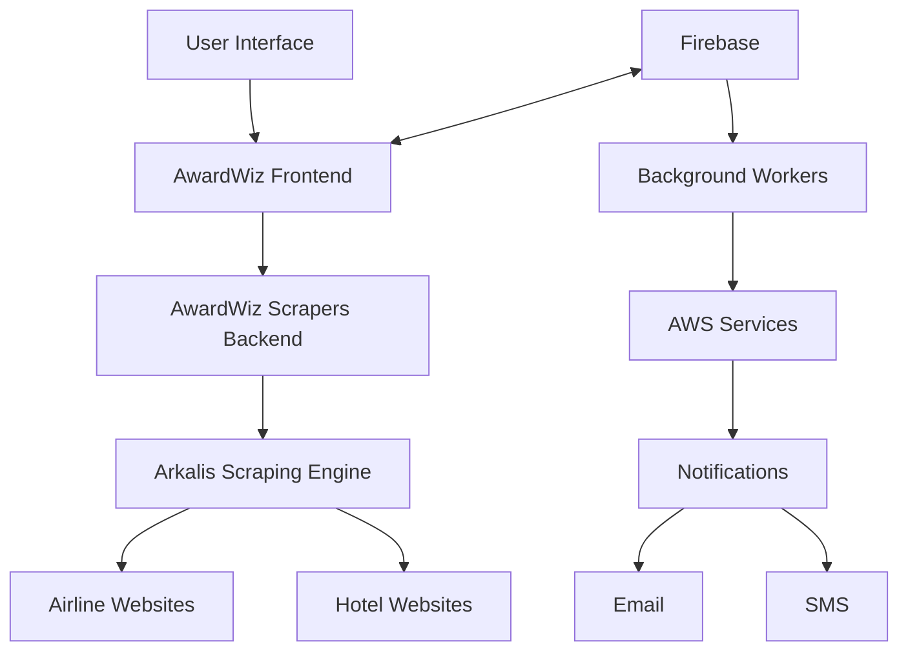
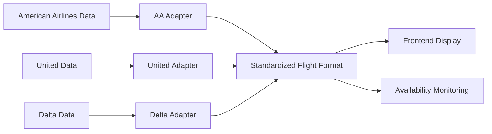
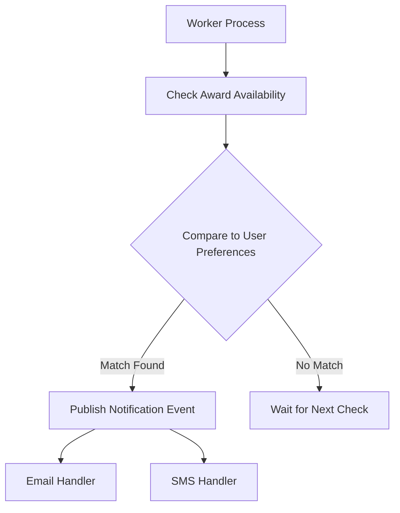
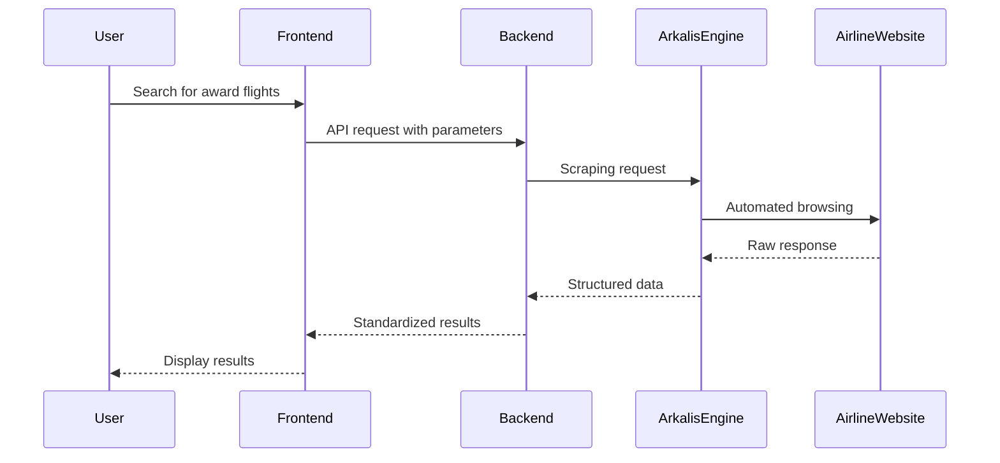
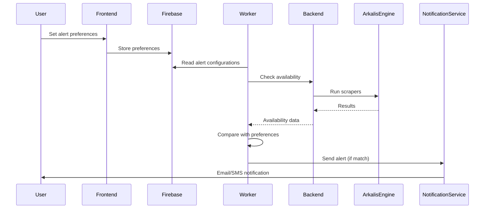

# AwardWiz System Patterns

## System Architecture

AwardWiz employs a three-tier architecture with specialized components for web scraping, incorporating elements of event-driven design for notifications:



## Key Components

### 1. Frontend (awardwiz/)
- **React Application**: Built using React with Vite
- **State Management**: Uses React Query for remote data fetching and state
- **UI Components**: Uses Ant Design for UI components

### 2. Backend Scrapers (awardwiz-scrapers/)
- **Server Component**: Express.js server exposing scraper endpoints
- **Authentication**: JWT-based authentication for secure access
- **Rate Limiting**: Per-user rate limiting to prevent excessive requests

### 3. Scraping Engine (arkalis/)
- **Anti-Detection Measures**: Specialized browser automation to avoid anti-botting systems
- **Caching System**: Sophisticated response caching to reduce redundant requests
- **Browser Automation**: Direct Chrome DevTools Protocol (CDP) usage for browser control

### 4. Notification System (Currently Firebase + Workers)
- **Firebase Storage**: User preferences, alert configurations stored in Firestore
- **Background Processing**: Workers check for availability changes
- **Notification Delivery**: Email templates with handlebars for dynamic content

## Design Patterns

### 1. Modular Scrapers
Each airline/hotel is implemented as a modular scraper with a common interface, allowing for:
- Independent maintenance and updates
- Parallel development
- Consistent data output format

```typescript
// Common interface for all scrapers
export const runScraper: AwardWizScraper = async (arkalis, query) => {
  // Airline-specific implementation
}

// Standard output format
const result: FlightWithFares = {
  departureDateTime: string,
  arrivalDateTime: string,
  origin: string,
  destination: string,
  flightNo: string,
  duration: number,
  aircraft: string,
  amenities: { hasPods: boolean, hasWiFi: boolean },
  fares: FlightFare[]
}
```

### 2. Adapter Pattern
The system converts heterogeneous airline data into a standardized format through adapters:



### 3. Event-Driven Notification
The notification system follows an event-driven pattern:



### 4. Browser Automation Strategy
Arkalis uses a sophisticated approach to browser automation:

- Human-like mouse movements
- Browser fingerprint randomization
- Proxy rotation capability
- Request interception and modification
- Response caching

## Data Flow

### 1. Search Flow



### 2. Notification Flow



## Integration Points

1. **Firebase Integration**:
   - Authentication
   - User preferences storage
   - Alert configuration storage

2. **AWS Integration** (To Be Implemented):
   - EventBridge for scheduling
   - Lambda for serverless scraping
   - SNS for notifications
   - DynamoDB for alert storage

## Technical Decisions

1. **Headless Browser Automation**: Direct Chrome DevTools Protocol usage instead of Puppeteer/Playwright to avoid detection.

2. **Response Caching**: Caching with controlled TTL to reduce load on airline servers and speed up responses.

3. **Modular Design**: Independent scrapers to isolate failures and allow partial system functionality even when some scrapers fail.

4. **Rate Limiting**: Per-user rate limiting to ensure fair resource usage and avoid overwhelming airline servers.

5. **JWT Authentication**: Secure endpoints using JSON Web Tokens to prevent unauthorized access.
